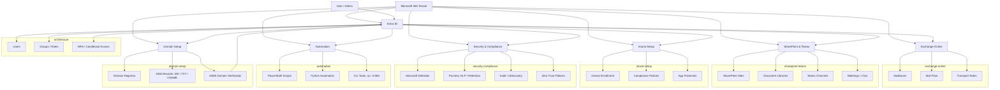

```mermaid
flowchart TD
    A[Microsoft 365 Tenant] --> B[Entra ID]
    A --> C[Exchange Online]
    A --> D[SharePoint & Teams]
    A --> E[Intune Setup]
    A --> F[Security & Compliance]
    A --> G[Automation]
    A --> H[Domain Setup]

    subgraph Domain [domain-setup]
        H1[Domain Registrar]
        H2[DNS Records: MX / TXT / CNAME]
        H3[M365 Domain Verification]
    end
    H --> H1
    H --> H2
    H --> H3
    H3 --> B

    subgraph Identity [architecture]
        B1[Users]
        B2[Groups / Roles]
        B3[MFA / Conditional Access]
    end
    B --> B1
    B --> B2
    B --> B3

    subgraph EXO [exchange-online]
        C1[Mailboxes]
        C2[Mail Flow]
        C3[Transport Rules]
    end
    C --> C1
    C --> C2
    C --> C3

    subgraph SPO [sharepoint-teams]
        D1[SharePoint Sites]
        D2[Document Libraries]
        D3[Teams Channels]
        D4[Meetings / Chat]
    end
    D --> D1
    D --> D2
    D --> D3
    D --> D4

    subgraph INTUNE [intune-setup]
        E1[Device Enrollment]
        E2[Compliance Policies]
        E3[App Protection]
    end
    E --> E1
    E --> E2
    E --> E3

    subgraph SEC [security-compliance]
        F1[Microsoft Defender]
        F2[Purview: DLP / Retention]
        F3[Audit / eDiscovery]
        F4[Zero Trust Policies]
    end
    F --> F1
    F --> F2
    F --> F3
    F --> F4

    subgraph AUTO [automation]
        G1[PowerShell Scripts]
        G2[Python Automation]
        G3[CLI Tools: az / m365]
    end
    G --> G1
    G --> G2
    G --> G3

    U[User / Admin] --> B
    B --> C
    B --> D
    B --> E
    B --> F
    B --> G
    B --> H
```
