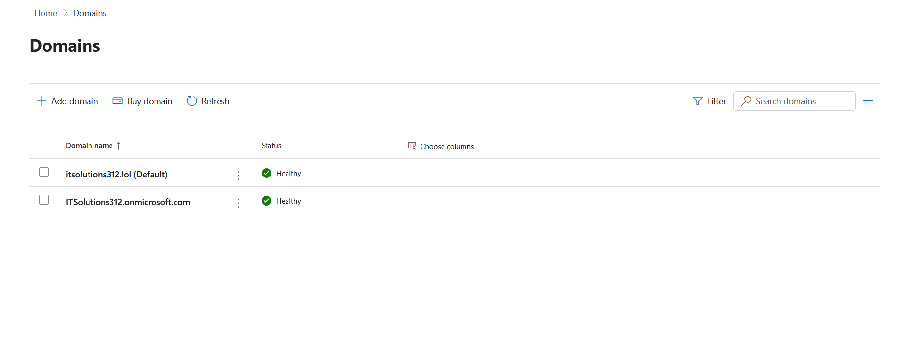
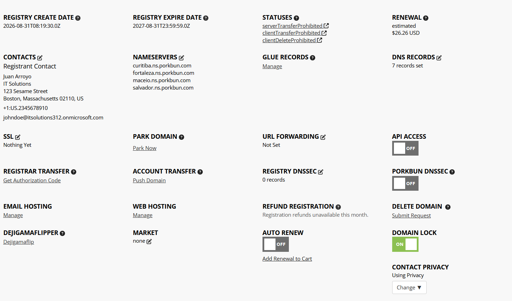
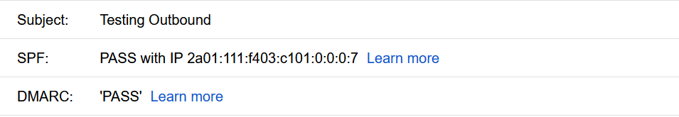

# Domain Setup — itsolutions312.lol

This section documents the full configuration and validation of the custom domain **itsolutions312.lol** within Microsoft 365.  
It includes DNS configuration, domain verification, email authentication setup, and mail flow testing.

---

## 1. Domain Verification

The domain was successfully added and verified in Microsoft 365 Admin Center using TXT verification through Porkbun DNS.

**Screenshot:**  

---

## 2. DNS Records Configured

The following DNS records were added at Porkbun to support Microsoft 365 services:

- **MX** record for mail routing  
- **TXT** record for SPF  
- **CNAME** records for DKIM  
- **TXT** record for DMARC  
- **Autodiscover CNAME** for Outlook/Exchange

**Screenshot:**  

---

## 3. Email Authentication Configuration

### ✔ SPF  
SPF was configured using the Microsoft 365 recommended value:

v=spf1 include:spf.protection.outlook.com -all

---

### ✔ DMARC  
DMARC was configured with a monitoring policy:

v=DMARC1; p=none; rua=mailto:dmarc@itsolutions312.lol

**Screenshot:**  

---

### ✔ DKIM  
DKIM was enabled in Microsoft 365 and validated through two CNAME records:

selector1._domainkey → selector1-itsolutions312-lol._domainkey.<tenant>.onmicrosoft.com
selector2._domainkey → selector2-itsolutions312-lol._domainkey.<tenant>.onmicrosoft.com

**Screenshot:**  

---

## 4. Mail Flow Testing

Inbound and outbound mail flow was tested using Gmail.  
Results confirmed:

- SPF: **PASS**  
- DKIM: **PASS**  
- DMARC: **PASS**  
- ARC: **PASS**

This verifies that the domain is fully authenticated and trusted by external mail providers.

**Screenshot:**  

---

## 5. Summary

The domain **itsolutions312.lol** is fully configured for Microsoft 365:

- Domain verified  
- DNS records correctly applied  
- SPF, DKIM, DMARC all passing  
- Mail flow fully functional  
- Authentication chain validated (SPF/DKIM/DMARC/ARC)

This domain is now production‑ready for use across Exchange Online, Teams, SharePoint, Intune, and Entra ID.

