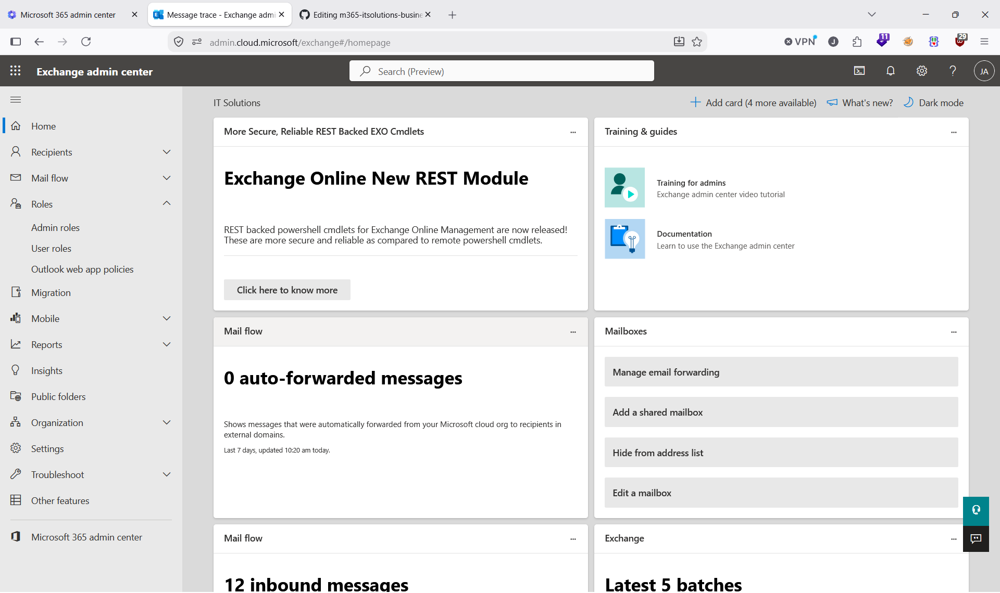
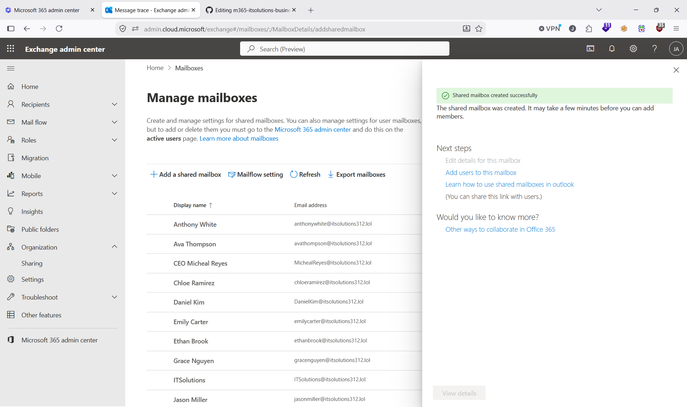
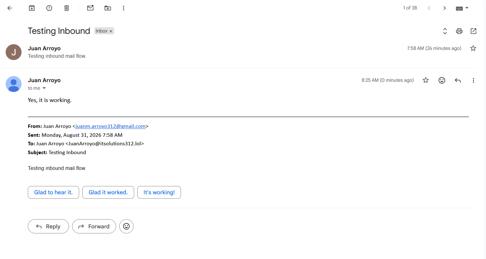
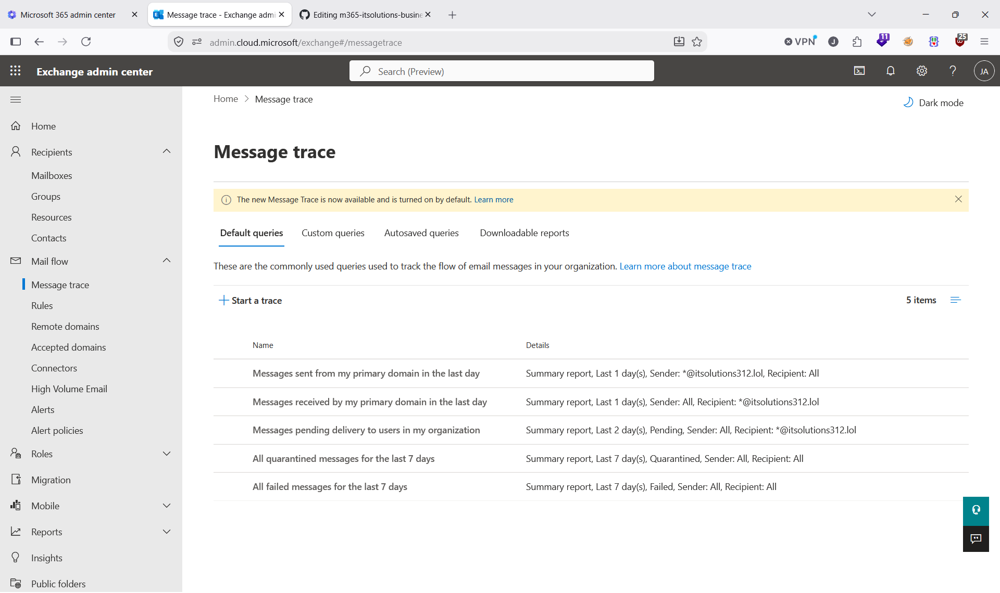
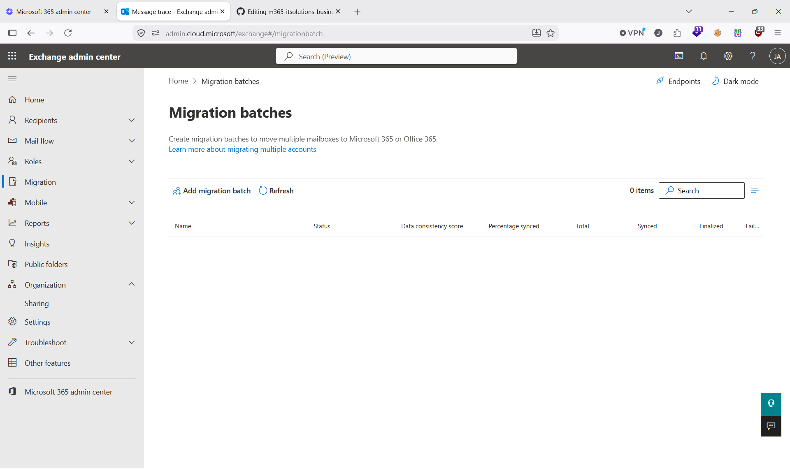

# 📧 Exchange Online

This folder covers my hands-on exploration and understanding of Exchange Online within Microsoft 365. My goal is to clearly understand how mail, calendars, groups, and mail flow operate across the tenant, and practice every core feature available without needing advanced licensing.

---

## 📘 Overview

Exchange Online is the backbone of communication in Microsoft 365.  
In this section, I worked through:

- 📬 User mailboxes  
- 📥 Shared mailboxes  
- 👥 Distribution lists  
- 📨 Microsoft 365 Groups (mailbox + calendar)  
- 🔄 Mail flow rules  
- 🛡️ Anti-spam and anti-malware policies  
- 🔍 Message trace  
- 📅 Calendar sharing and permissions  
- 🧠 Conceptual understanding of advanced Exchange features  

This gives me a complete picture of how email and scheduling work across the organization.

---

## 📬 User Mailboxes

**Hands-on:**
- Created and managed user mailboxes  
- Adjusted mailbox settings  
- Tested sending and receiving mail  

**Understanding:**  
Every licensed user gets a mailbox that integrates with Outlook, Teams, and the rest of M365.

---

## 📥 Shared Mailboxes

**Hands-on:**
- Created shared mailboxes  
- Assigned member permissions  
- Tested shared inbox behavior  

**Understanding:**  
Shared mailboxes allow teams to manage communication without individual licensing.

---

## 👥 Distribution Lists

**Hands-on:**
- Created distribution lists  
- Added and removed members  
- Tested group email delivery  

**Understanding:**  
Distribution lists provide simple group-based communication without extra workloads.

---

## 📨 Microsoft 365 Groups

**Hands-on:**
- Created M365 Groups  
- Explored shared mailbox and shared calendar  
- Verified integration with SharePoint and Teams  

**Understanding:**  
M365 Groups unify collaboration across mail, files, and chat.

---

## 🔄 Mail Flow Rules

**Hands-on:**
- Created transport rules  
- Tested external mail restrictions  
- Added disclaimers and forwarding rules  

**Understanding:**  
Mail flow rules control how messages move through the organization.

---

## 🛡️ Anti-Spam and Anti-Malware

**Hands-on:**
- Reviewed default policies  
- Adjusted spam thresholds  
- Tested filtering behavior  

**Understanding:**  
Exchange Online Protection (EOP) provides built-in filtering for all tenants.

---

## 🔍 Message Trace

**Hands-on:**
- Ran message traces  
- Tracked delivery paths  
- Verified mail flow troubleshooting steps  

**Understanding:**  
Message trace is essential for diagnosing mail delivery issues.

---

## 📅 Calendar Management

**Hands-on:**
- Shared calendars  
- Adjusted permissions  
- Tested scheduling assistant  

**Understanding:**  
Exchange powers all calendar functionality across Outlook and Teams.

---

## 🧠 Advanced Exchange Features (Conceptual)

Even without higher licensing, I learned how these operate in enterprise environments:

- Litigation hold  
- Unlimited archiving  
- Advanced anti-phishing (Defender for Office 365)  
- eDiscovery Premium  
- Advanced audit  
- Hybrid Exchange concepts

---

## ⭐ Summary

I built a complete understanding of Exchange Online by combining hands-on practice, UI exploration, and conceptual learning. Even without advanced licensing, I gained practical experience with core features and learned how enterprise-level mail flow, security, and collaboration operate inside Microsoft 365.
