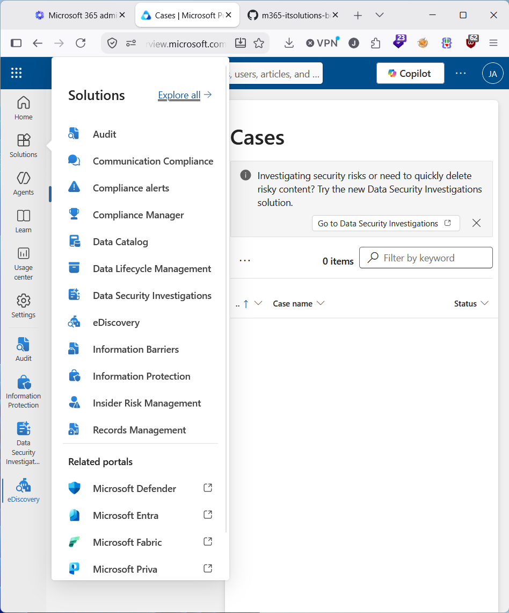
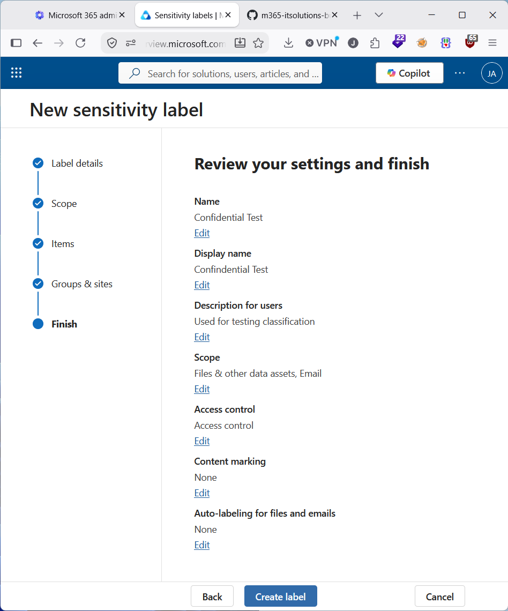
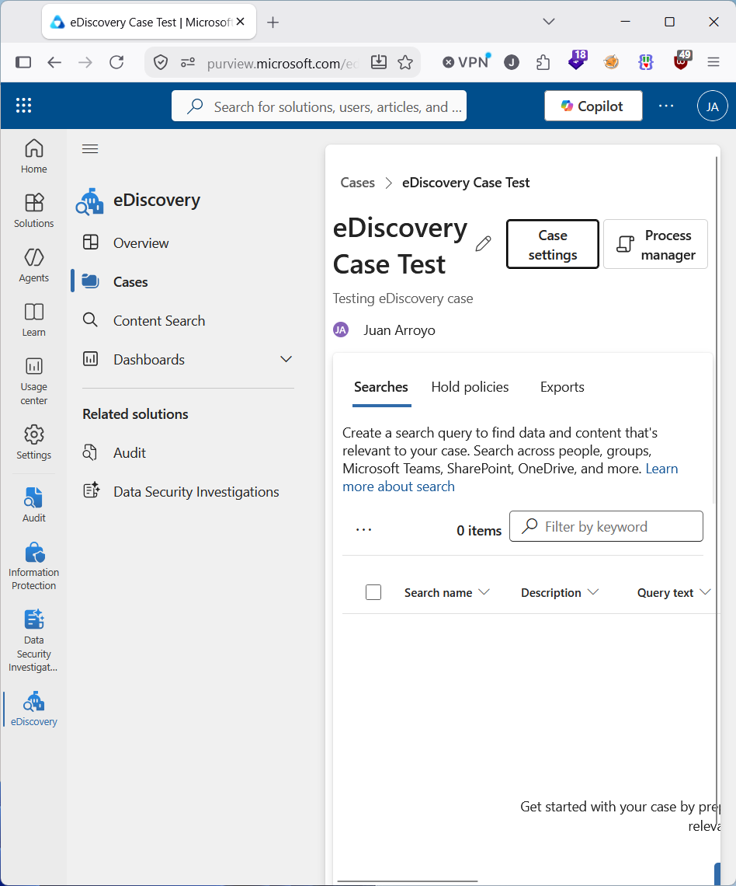

# 🛡️ Security & Compliance

## 🎯 Purpose
Implement enterprise‑grade data protection, auditing, and compliance using Microsoft Purview.

## ⚙️ Configuration
- Data Loss Prevention (DLP)
- Retention & records management
- Sensitivity labels & encryption
- eDiscovery & audit logging

## 🧭 Governance
- Insider risk management
- Compliance score tracking
- Conditional access policies

