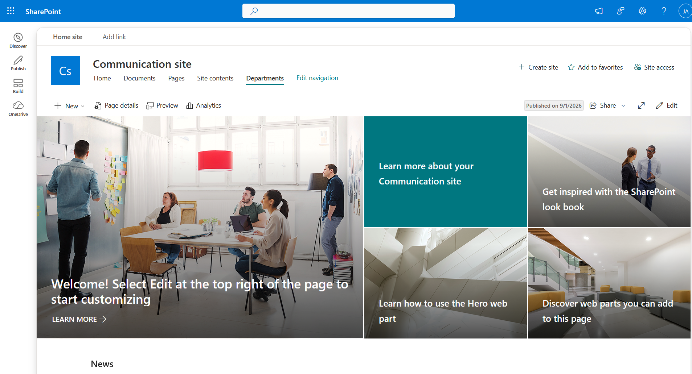
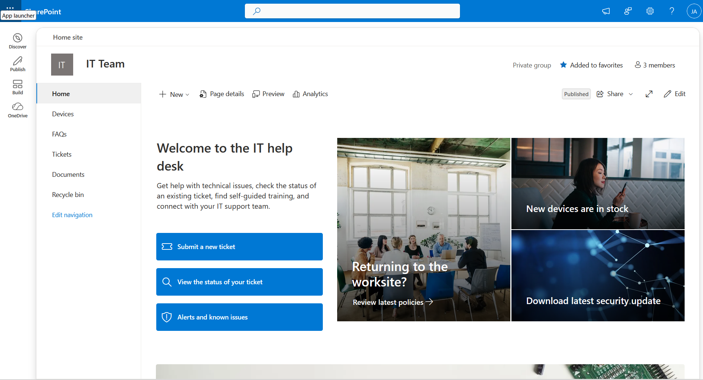
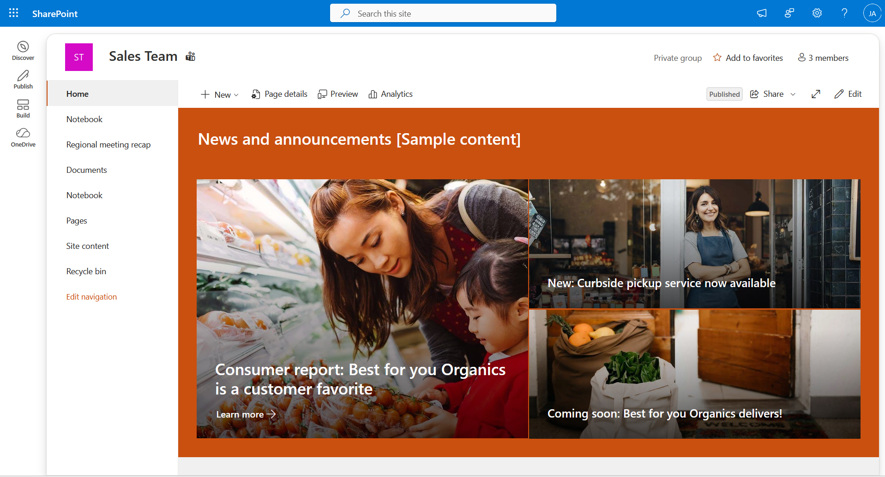
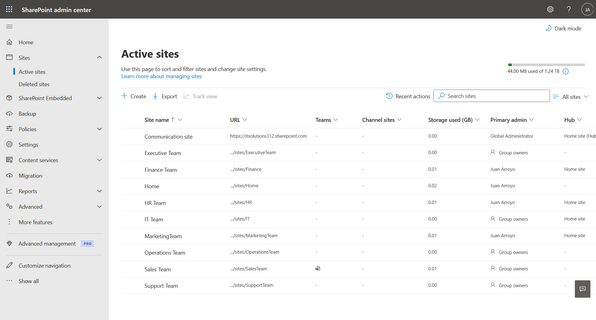
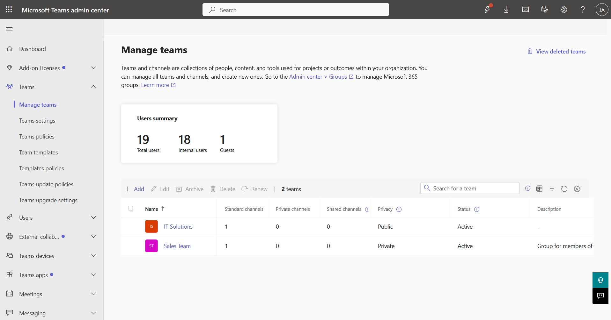

# SharePoint–Teams Enterprise Architecture (Homelab)

## Overview
Built a full Microsoft 365 enterprise environment integrating **SharePoint Communication Sites**, **Team Sites**, and **Microsoft Teams** — modeled after Fortune 500 intranet architecture and least‑privilege security principles.

---

## Structure
| Component | Purpose | Access Model |
|------------|----------|---------------|
| **Communication Sites** | Department intranet portals for publishing | Entra Security Groups |
| **Team Sites** | Collaboration spaces for projects & files | Microsoft 365 Groups |
| **Microsoft Teams** | Real‑time communication & collaboration | Linked to Team Sites |
| **Hub Site** | Central navigation & branding | Global Admin |

---

## Departments
- **Finance Team** – Department portal for resources and workflows  
- **HR Team** – Employee forms, benefits, and onboarding  
- **IT Team** – Help desk, device inventory, and ticket system  
- **Sales Team** – Announcements and regional updates  
- **Communication Site** – Company‑wide homepage and navigation hub  

*(Screenshots: Finance, HR, IT, Sales, Communication Sites)*

---

## Administration
- **SharePoint Admin Center:** Active sites, storage, hub associations  
- **Teams Admin Center:** Team creation, privacy, and membership  
*(Screenshots: Admin Centers overview)*

---

## Security Model
- Access via **Groups only**, never individuals  
- Communication Sites → Security Groups  
- Team Sites & Teams → Microsoft 365 Groups  
- Roles follow least‑privilege:
  - Executives → Visitor  
  - Managers → Owner  
  - Staff → Member  
  - IT Admins → Global Admin  

---

## Governance
- Communication Sites = internal‑public  
- Team Sites = private collaboration  
- Teams auto‑connect to their SharePoint site  
- Hub Site unifies navigation and branding  

---

## Summary
✅ Enterprise‑grade SharePoint + Teams architecture  
✅ Group‑based permissions (least privilege)  
✅ Departmental intranet + collaboration spaces  
✅ Admin‑level configuration and governance  

*(Visual references: all screenshots included in folder)*

---

**Author:** Juan Arroyo  
**Date:** September 2026  
**Purpose:** Showcase enterprise SharePoint–Teams design and security implementation.
